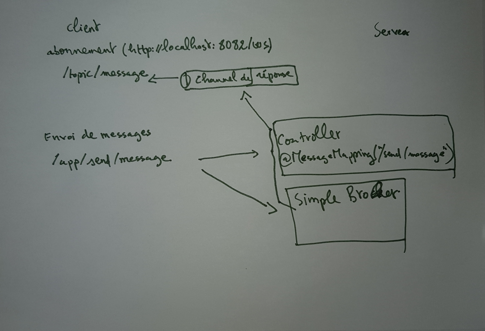

# Serveur

**Classe WebSocketConfig**

     @Configuration
     @EnableWebSocketMessageBroker
     public class WebSocketConfig implements WebSocketMessageBrokerConfigurer {
     //1   
     @Override
     public void registerStompEndpoints(StompEndpointRegistry registry) {
         registry.addEndpoint("/ws")
         //2 
         .setAllowedOrigins("*")
         .withSockJS();
     }
     //3   
     @Override
     public void configureMessageBroker(MessageBrokerRegistry config){
         config.enableSimpleBroker("/topic/");
         config.setApplicationDestinationPrefixes("/app");
     }}
_1_

Méthode permettant de définir l'endpoint que nos clients utiliseront pour se connecter au serveur

    http://localhost:8082/socket
 
_2_    

Permet de recevoir les requêtes de n'importe quelle origine.

_3_

Méthode permettant de configurer nos topics. Nous avons déclaré un seul topic portant le nom **topic**, les 
clients peuvent s'abonner à ce topic pour recevoir les messages du serveur.

Lorsque les clients vont envoyer leurs messages ils doivent préfixer leurs endpoints par /app

    http://localhost:8082/app/send/message
    
**Classe MessagingController**

    `
    //1
    @MessageMapping("/send/message")
    //2 
    @SendTo("/topic/message")
    public String broadcastNews(@Payload String message) {
        System.out.println("message " +message);
        return message;
    }`
    
A chaque fois qu'un client invoque l'url http://localhost:8082/app/send/message un message est envoyé 
à tous les clients abonnés au topic **`topic/message`**

# Client

    var webSocketProd = new SockJS('http://localhost:8082/ws');
    
Permet de se connecter au serveur

    var stompClient = Stomp.over(webSocketProd);
    
Permet de créer un client stomp, ce dernier enverra les messages au format STOMP (Streaming Text Oriented Message Protocol)

    stompClient.connect({}, this.onConnected.bind(this), this.onError.bind(this));
    
Permet de se connecter au serveur

    function onConnected() {
    
        this.stompClient.subscribe('/topic/message', this.onMessageReceived);
    
    }
 
Permet de s'abonner au topic _**topic/message**_

    function sendMessage (){
    
        stompClient.send("/app/send/message" , {}, $('#test').val());
        $('#test').val('');
    }   
    
Permet d'envoyer des messages au serveur

# Schéma de l'architecture

#Builder le projet 

_Docker_

Au préalable il faut ajouter le plugin suivant dans le pom.xml

    <plugin>
        <groupId>com.google.cloud.tools</groupId>
        <artifactId>jib-maven-plugin</artifactId>
        <version>1.3.0</version>
        <configuration>
            <from>
                <image>
                    openjdk:11-jre-slim
                </image>
            </from>
                <to>
                    <image>client:${project.version}</image>
                </to>
            <container>
                <jvmFlags>
                    <jvmFlag>-Xms512m</jvmFlag>
                </jvmFlags>
            </container>
        </configuration>
    </plugin>

Pour builder les images et les pousser sur dockerHub il suffit de taper la commande suivante 

    mvn compile jib:build
    
Pour builder les images localement, tapez la commande suivante 

    mvn compile jib:dockerBuild
    
Une fois que vous avez fini de builder, lancez la commande suivante 

    docker-compose up
    
Ensuite allez sur la page http://localhost:8083
